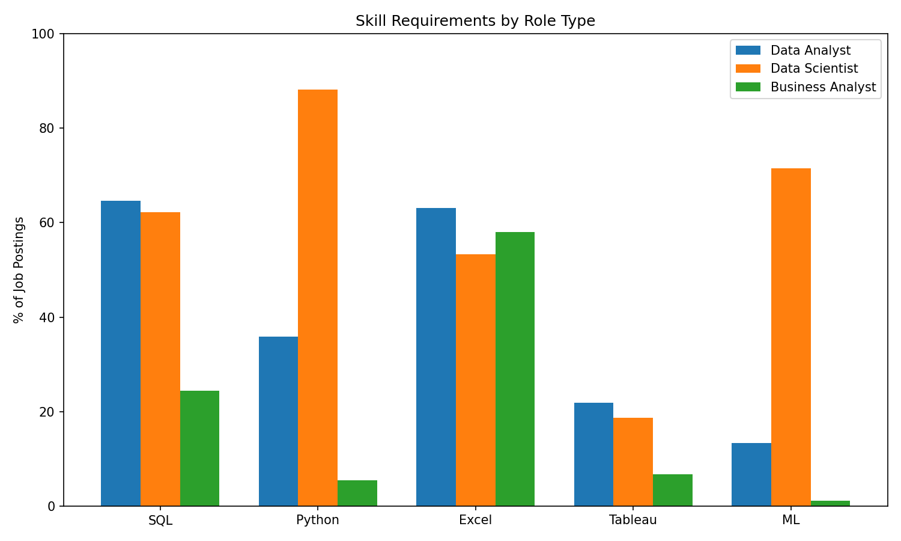
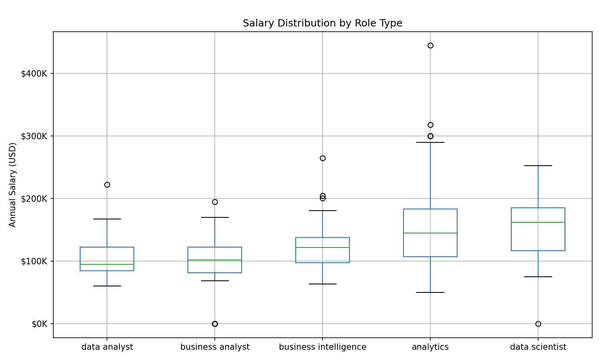

# Data Analyst Job Market Analysis

Analysis of 1,689 data-related job postings from LinkedIn to understand skill requirements, salary benchmarks, and hiring trends.

## Key Findings

**Salary by Role (Median)**
- Data Scientist: $162,200
- Data Analyst: $95,000
- Entry-level: $105,200

**Most In-Demand Skills**
| Skill | % of Postings |
|-------|---------------|
| Excel | 59% |
| Communication | 55% |
| SQL | 48% |
| Stakeholder Management | 46% |
| Python | 34% |

**Entry-Level Data Analyst Requirements**
- Excel (45%) — most requested
- SQL (37%)
- Communication (31%)
- Python (21%) — nice-to-have, not required
- Tableau (13%)

## Visualizations

### Skills by Role Type


### Salary Distribution


## Insights

1. **Excel still dominates** — mentioned in 59% of postings, more than SQL or Python
2. **Soft skills matter** — communication and stakeholder management are top 5 requirements
3. **Python separates analysts from scientists** — 36% for analysts vs 88% for data scientists
4. **Entry-level bar is lower than expected** — focus on Excel, SQL, and communication first

## Tech Stack

- Python (pandas, matplotlib, seaborn)
- DuckDB for fast SQL queries on CSV
- Jupyter Notebook

## Data Source

LinkedIn Job Postings dataset from [Kaggle](https://www.kaggle.com/datasets/arshkon/linkedin-job-postings)

## Run Locally
```bash
git clone https://github.com/YOUR_USERNAME/data-analyst-job-market.git
cd data-analyst-job-market
pip install pandas duckdb matplotlib seaborn
jupyter notebook notebooks/01_exploration.ipynb
```